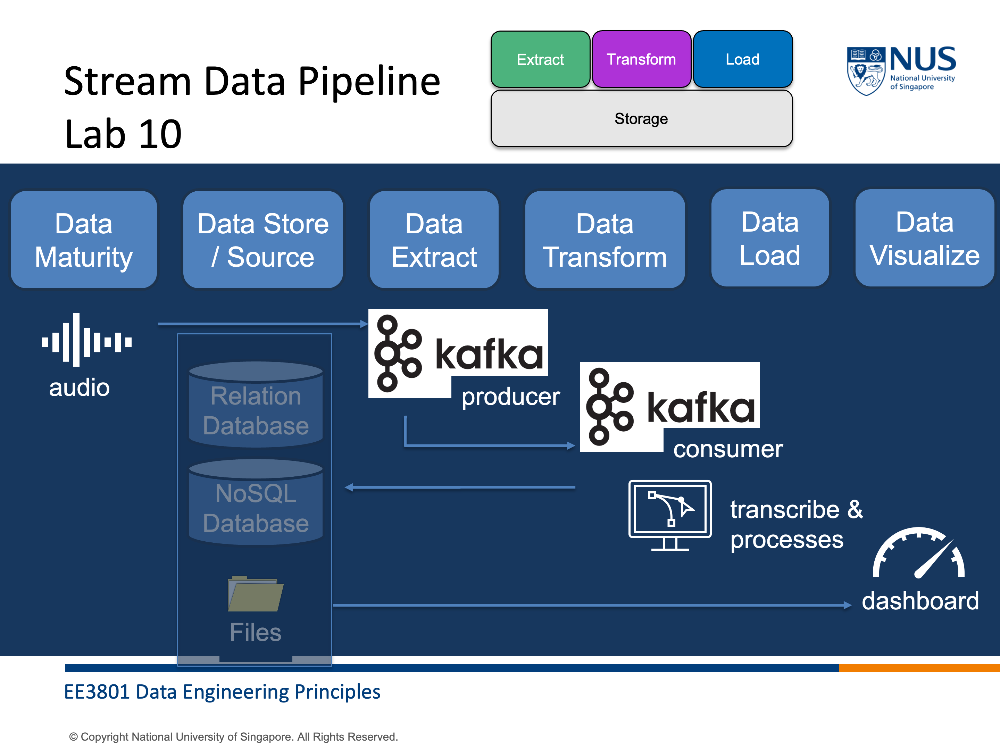

This lab gives you hands-on experience with a stream data pipeline using Apache Kafka. You will learn how to send audio data from a producer, transmit it through Kafka, and consume it on another machine for real-time processing and analysis.

Start with the producer notebook and then continue to the consumer notebook to complete the workflow.

[Lab 10 Stream Data Pipeline II Producer](./lab10_1%20stream_data_pipeline_2_producer.md)\
[Lab 10 Stream Data Pipeline II Consumer](./lab10_2%20stream_data_pipeline_2_consumer.md)

