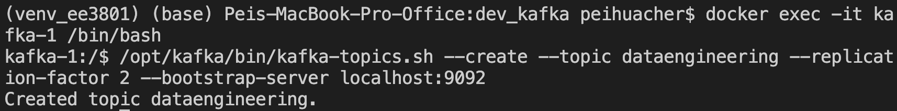
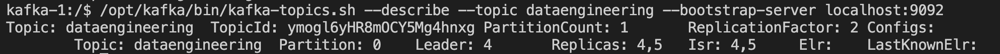
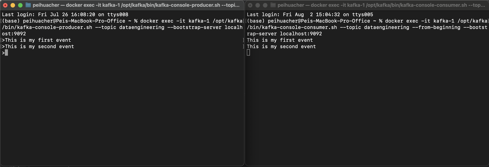

# Lab 10 Stream Data Pipeline I¶

- Installing Softwares
- Scenario: Streaming audio 

Stream in audio, process and save the data for reporting.

Create a new jupyter notebook file "stream\_data\_pipeline\_1.ipynb".

In [ ]:

```
import os
os.chdir('/Users/<username>/projects/ee3801')
```

# 1. Install kafka¶

1. Go to the directory and create the following directories.

    `cd /Users/<username>/projects/ee3801/dev_kafka`

    `mkdir data`
2. Download [docker-compose.yml](https://github.com/apache/kafka/tree/trunk/docker/examples/docker-compose-files/cluster/isolated/plaintext) and save in the `dev_kafka` folder.
3. Open the docker-compose.yml and observe that there are 3 kafka broker with 3 isolated controllers.
4. Replace the localhost to host.docker.internal in the docker-compose.yml file and save the file.
5. Run the docker command in command line or terminal. Ctrl-C to terminate in the terminal and start the dev\_kafka docker containers in docker dashboard.

    `IMAGE=apache/kafka:latest docker compose -f docker-compose.yml up`

# 2. Sending messages between producer and consumers in Kafka¶

1. Access docker container kafka-1 and create a new topic.

    `docker exec -it kafka-1 /bin/bash`

    - Create a new topic 
 `/opt/kafka/bin/kafka-topics.sh --create --topic dataengineering --replication-factor 2 --bootstrap-server localhost:9092`


    - Show details of the new topic created. Then exit the terminal.
 `/opt/kafka/bin/kafka-topics.sh --describe --topic dataengineering --bootstrap-server localhost:9092`


    - Run an instance in this terminal
 `docker exec -it kafka-1 /opt/kafka/bin/kafka-console-producer.sh --topic dataengineering --bootstrap-server localhost:9092`
2. Open a new terminal. Access the docker container kafka-1.

    - Listen to the messages send by the producer by starting a consumer. 

`docker exec -it kafka-1 /opt/kafka/bin/kafka-console-consumer.sh --topic dataengineering --from-beginning --bootstrap-server localhost:9092`
3. In the producer terminal, enter producer messages. You will see these messages appearing in the consumer terminal.

    `This is my first event`

    `This is my second event`


4. After successfully performing the tasks above, what do you think is Apache Kafka? (Enter and submit your answer in the notebook.)
5. What are the possible examples of using Apache Kafka? (Enter and submit your answer in the notebook.)

# 3. Scenario: Streaming audio¶

The company would like to build an in-house automatic speech transcribing tool. The system stream in audio from your device, transcribe it using Open AI's whisper model and save the transcribed text for reporting.

# 3.1 Stream audio data auto-transcription¶

The latency of a single stream of audio data auto-transcription. Take note of the time taken to read, write and transcribe the audio.

In [ ]:

```
# # install python packages
# !pip install --upgrade pip
# # for mac users
# !brew install portaudio 
# !pip3 install pyaudio
```

# 3.1.1 Stream in audio¶

In [ ]:

```
# Testing audio setup in this device
import pyaudio
audio = pyaudio.PyAudio()
print("audio.get_device_count():",audio.get_device_count())
for i in range(audio.get_device_count()):
    print(audio.get_device_info_by_index(i))
```

In [ ]:

```
# This is to determine which input audio and output audio you will use.
# Explore and find the right index to use for input and output in your device.
print("Choosing my input audio:",audio.get_device_info_by_index(1))
print("Choosing my output audio:",audio.get_device_info_by_index(2))

audio.terminate()
```

# 3.1.2 Load whisper model once¶

In [ ]:

```
# !pip3 install -U jupyter
# !pip3 install -U ipywidgets
# !pip3 install -U openai-whisper
```

In [ ]:

```
## python 3.11.5
# !pip3 install -U torch
# !pip3 uninstall numpy -y
# !pip3 install numpy==1.26.4
## restart kernel
```

In [ ]:

```
import whisper
model = whisper.load_model("medium.en") 
```

# 3.1.3 Read from the script as you are recording¶

```
Producers are fairly straightforward – they send messages to a topic and partition, maybe request an acknowledgment, retry if a message fails – or not – and continue. Consumers, however, can be a little more complicated.

Consumers read messages from a topic. Consumers run in a poll loop that runs indefinitely waiting for messages. Consumers can read from the beginning – they will start at the first message in the topic and read the entire history. Once caught up, the consumer will wait for new messages.
```

# 3.1.4 Capture one sentence¶

Write Audio to file, Read Aduio from file, Transcribe, Translate

In [ ]:

```
import pyaudio
import wave

def record_audio():
    FORMAT = pyaudio.paInt16
    CHUNK = 1024
    RECORD_SECONDS = 5
    WAVE_OUTPUT_FILENAME = "output.wav"
    DEVICE_ID = 0 # airpod microphone

    audio = pyaudio.PyAudio()
    RATE = int(audio.get_device_info_by_index(DEVICE_ID)['defaultSampleRate'])
    CHANNELS = int(audio.get_device_info_by_index(DEVICE_ID)['maxInputChannels'])
    
    stream = audio.open(
        format=FORMAT,
        channels=CHANNELS,
        rate=RATE,
        input=True,
        frames_per_buffer=CHUNK,
        input_device_index=DEVICE_ID
    )

    frames = []

    for i in range(0, int(RATE / CHUNK * RECORD_SECONDS)):
        data = stream.read(CHUNK)
        frames.append(data)

    stream.stop_stream()
    stream.close()
    audio.terminate()

    waveFile = wave.open(WAVE_OUTPUT_FILENAME, 'wb')
    waveFile.setnchannels(CHANNELS)
    waveFile.setsampwidth(audio.get_sample_size(FORMAT))
    waveFile.setframerate(RATE)
    waveFile.writeframes(b''.join(frames))
    waveFile.close()

# capture audio once
record_audio()

audio = whisper.pad_or_trim(whisper.load_audio("output.wav"))
print(whisper.transcribe(model, audio, fp16=False)["text"])
```

# 3.1.5 Capture a paragraph¶

What did you observe from the recordings below? Submit your findings.

In [ ]:

```
from datetime import datetime
import sys

start_time = datetime.now()

try:
    while True:
        before_time=datetime.now()
        record_audio()
        before_load_time=datetime.now()
        # read wav file into whisper file
        audio = whisper.pad_or_trim(whisper.load_audio("output.wav"))
        before_transcribe_time=datetime.now()
        print("transcribe:",whisper.transcribe(model, audio, fp16=False)["text"])
        before_transcribe_translate_time=datetime.now()
        print("transcribe and translate:",whisper.transcribe(model, audio, task="translate", fp16=False)["text"])
        after_transcribe_translate_time = datetime.now()
        print("record time taken:",before_load_time-before_time)
        print("load record time taken:",before_transcribe_time-before_load_time)
        print("transcribe time taken:",before_transcribe_translate_time-before_transcribe_time)
        print("transcribe translate time taken:",after_transcribe_translate_time-before_transcribe_translate_time)
        print("totla time taken:",after_transcribe_translate_time-before_time)

        if (datetime.now() - start_time).seconds > 60: #exit program after 1min
            stream.stop_stream()
            stream.close()
            # audio.terminate()
            print("* Exit program after 1min *")
            break
except KeyboardInterrupt as kie:
    print("Program terminated by user")
sys.exit(0)
```

# 3.1.6 Record audio, Transcribe, Translate¶

What did you observe from the recordings below? Submit your findings.

In [ ]:

```
import pyaudio
import wave
import numpy as np
from datetime import datetime
import whisper
import sys

FORMAT = pyaudio.paInt16
CHUNK = 1024
RECORD_SECONDS = 5
DEVICE_ID = 0

audio = pyaudio.PyAudio()
RATE = int(audio.get_device_info_by_index(DEVICE_ID)['defaultSampleRate'])
CHANNELS = int(audio.get_device_info_by_index(DEVICE_ID)['maxInputChannels'])

stream = audio.open(
    format=FORMAT,
    channels=CHANNELS,
    rate=RATE,
    input=True,
    frames_per_buffer=CHUNK,
    input_device_index=DEVICE_ID
)

start_time = datetime.now()

try:
    while True:
        before_time = datetime.now()
        frames = []
        for i in range(0, int(RATE / CHUNK * RECORD_SECONDS)):
            data = stream.read(CHUNK, exception_on_overflow = False)
            frames.append(data)
        raw_data = b''.join(frames)
        # before_buffer_time = datetime.now()
        audio_data = np.frombuffer(raw_data, np.int16).flatten().astype(np.float32) / 32768.0 
        # before_trim_time = datetime.now()
        audio_data = whisper.pad_or_trim(audio_data)
        before_transcribe_time = datetime.now()
        print(whisper.transcribe(model, audio_data, fp16=False)["text"])
        before_transcribe_translate_time = datetime.now()
        print(whisper.transcribe(model, audio_data, task="translate", fp16=False)["text"])
        after_transcribe_translate_time = datetime.now()

        print("read time taken:",before_transcribe_time-before_time)
        # print("buffer time taken:",before_trim_time-before_buffer_time)
        # print("trim time taken:",before_transcribe_time-before_trim_time)
        print("transcribe time taken:",before_transcribe_translate_time-before_transcribe_time)
        print("transcribe translate time taken:",after_transcribe_translate_time-before_transcribe_translate_time)

        if (datetime.now() - start_time).seconds > 60: #exit program after 1min
            stream.stop_stream()
            stream.close()
            audio.terminate()
            print("* Exit program after 1min *")
            break

except KeyboardInterrupt as kie:
    print("* Program terminated by user *")
    stream.stop_stream()
    stream.close()
    audio.terminate()
except Exception as e:
    # print("Exception:", e)
    if stream!=None:
        stream.stop_stream()
        stream.close()
        audio.terminate()
sys.exit(0)
```

# 4. Install Kafka on docker in EC2 Instance¶

If you have not created an ec2 instance for ee3801 part 2, go to "2. batch\_data\_pipeline.html" to create the instance and install docker before continuing with the instructions below.

1. Launch the ee3801part2 instance
2. Click on the instance and click Connect. Go to SSH client. Copy the Example.
3. Open a terminal and ssh into server.
4. You can install Kafka in this docker in EC2 instance by following the instructions in section 1 in this lab but take note:

    - Name the folder as uat\_kafka
    - Use this command to download docker-compose.yml

        `wget https://raw.githubusercontent.com/apache/kafka/trunk/docker/examples/docker-compose-files/cluster/isolated/plaintext/docker-compose.yml`
    - edit docker-compose.yml by replacing localhost with 172.17.0.1 (instead of host.docker.internal).

In this lab we have created the development environment on local machine's docker and user acceptance test (uat) environment on EC2 instance's docker. This is to fully test the systems before pushing to a live production server. We will not cover production environment in this module.

# Conclusion¶

1. You have successfully streamed audio data from your device and saved to a file.
2. You have successfully streamed audio data and directly transcribed the audio to text.

**Questions to ponder**

1. What do you think is the difference between batch and stream data pipeline?
2. What applications need to use the stream data pipeline?

# Submissions next Wed 9pm (30 Oct 2024)¶

Submit your ipynb as a pdf. Save your ipynb as a html file, open in browser and print as a pdf. Include in your submission:

```
Section 2 Points 4 and 5. 

Section 3.1.5.

Section 3.1.6.

Answer the questions to ponder.
```

~ The End ~